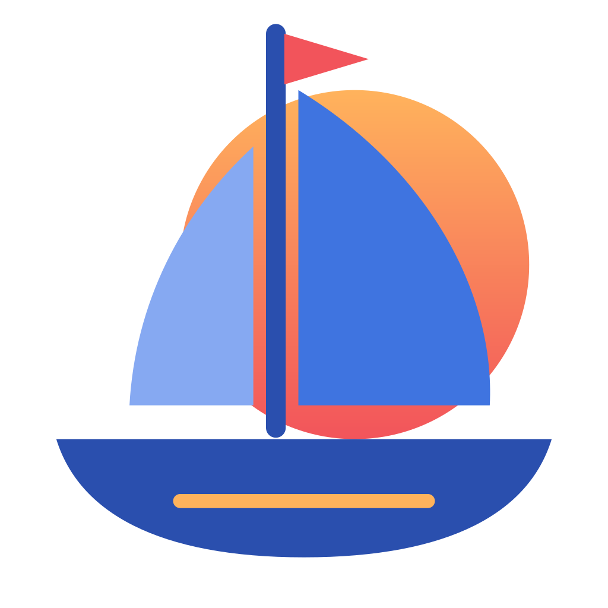

<a id="deutsch"></a>

<p align="center">
  
</p>

<h1 align="center">Caravel – Entdecke das Web</h1>

<p align="center"><b>Deutsch</b> · <a href="#english">English</a></p>

Chromium-Browser (Electron 44) mit Claude-Integration, Werbeblocker auf Basis der uBlock-Origin-Filterlisten,
eingebautem VPN, Chrome-Erweiterungen und Chromecast.

## Installation

`dist/Caravel-Setup-3.2.0.exe` ausführen. Der Installer fragt nach dem Zielordner, legt Verknüpfungen an und
registriert Caravel in den Windows-„Standard-Apps“ als Browser. Das installierte Programm braucht kein Node.js.

## Funktionen

| Funktion | Bedienung |
|---|---|
| **Deutsch und Englisch** – automatisch nach Windows-Sprache oder fest gewählt | Einstellungen › Allgemein › Sprache |
| **KI-Assistent wählbar** – Claude, ChatGPT oder keiner | Einstellungen › KI-Assistent |
| **KI-Seitenleiste** – claude.ai bzw. chatgpt.com neben jeder Seite (abschaltbar) | `Strg+E`, Knopf „Claude“/„ChatGPT“ |
| **Seite an die KI übergeben / zusammenfassen**, Auswahl erklären/übersetzen | `Strg+Umschalt+L`, Rechtsklick |
| **Claude in Chrome** – offizielle Erweiterung über eine Kompatibilitätsschicht | Einstellungen › KI-Assistent (Claude) |
| **MCP-Server für Claude Code und Codex** – Tabs öffnen, lesen, klicken, ausfüllen, Screenshots | Einstellungen › KI-Assistent |
| **Werbeblocker** mit uBlock-Origin-Listen inkl. YouTube-Werbung | Schild in der Adressleiste |
| **VPN** – Tor mit Länderwahl (kostenlos) oder eigene Server (WireGuard, SOCKS5, HTTP) | „VPN“ oben rechts |
| **Tab-Leiste wählbar** – Caravel (Seitenleiste), Chrome (oben) oder Safari (unter der Adressleiste), Favoritenleiste, kompakte Darstellung | Einstellungen › Darstellung |
| **Websites abdunkeln** – Seiten ohne eigenen Dunkelmodus werden im dunklen Design automatisch dunkel | Einstellungen › Darstellung |
| **Spaces**, **Split View**, **Peek**, **Befehlspalette** | Space-Symbole, `Strg+Umschalt+S`, Umschalt+Klick, `Strg+K` |
| **Fokus-Modus**, **Seiten-Notizen**, **Zeitkapseln**, **Tab-Schlaf** | `Strg+Umschalt+F`, `Strg+Umschalt+U`, Seitenleiste |
| **Leser-Modus mit Vorlesen**, **Seite als Markdown kopieren** | `F9`, Rechtsklick |
| **Chrome-Erweiterungen** aus dem Chrome Web Store | Web Store › „Hinzufügen“ |
| **Chromecast wie in Chrome** – Cast-Knöpfe von Webseiten (z. B. YouTube), Tab und Bildschirm spiegeln, Video der Seite, lokale Dateien; alle Geräte mit Status, Lautstärke und Steuerung | Cast-Symbol, ⋮ › Streamen, Rechtsklick |
| **Automatische Updates** über GitHub-Releases (laden im Hintergrund, installieren beim Beenden) | Einstellungen › Über Caravel |
| **Privater Space (Inkognito)** – eigene flüchtige Sitzung, kein Verlauf, Daten weg beim Schließen | `Strg+Umschalt+N`, Rechtsklick auf Link |
| **Passwort-Manager** – Speichern nach der Anmeldung, Ausfüllen per Auswahlmenü, mit Windows verschlüsselt, CSV-Import/-Export | Einstellungen › Passwörter |
| **Import aus Chrome, Edge, Brave** – Favoriten und Verlauf | Einstellungen › Allgemein |
| **Pop-up-Blocker**, **Website-Einstellungen** (Kamera, Mikrofon, Standort, Benachrichtigungen, Pop-ups, Ton, Zoom pro Website) | Schloss-Symbol in der Adressleiste |
| **Seite übersetzen** (Google Übersetzer), **Bild-im-Bild**, Video-Schleife | Symbol in der Adressleiste, Rechtsklick |
| **Sitzung mit Vor/Zurück-Verlauf** und Scrollposition – auch bei schlafenden Tabs | automatisch |
| **Downloads**: Ordner wählbar, „Immer fragen“, Liste bleibt erhalten, Warnung beim Beenden | Einstellungen › Downloads |
| **Chrome-Tastenkürzel**: Strg+S, Strg+O, Strg+U, F3, Strg+Bild↑/↓, Strg+F4, Strg+Umschalt+Entf, Alt+Pos1 … | ⋮ › Tastenkürzel |
| **Geräteauswahl** für WebUSB, WebHID, Web Serial und Web Bluetooth, „Trotzdem fortfahren“ bei Zertifikatsfehlern | automatisch |

### Claude Code anbinden

Einstellungen › KI-Assistent › Claude › „Caravel als MCP-Server für Claude Code“ einschalten und den angezeigten Befehl einmal ausführen:

```
claude mcp add --transport http --scope user caravel http://127.0.0.1:47823/mcp --header "Authorization: Bearer <Token>"
```

### Codex anbinden

Einstellungen › KI-Assistent › ChatGPT › „Caravel als MCP-Server für Codex“ einschalten und „In Codex eintragen“ klicken.
Caravel ergänzt dann `~/.codex/config.toml` (ein vorhandener Caravel-Eintrag wird ersetzt, alles andere bleibt):

```toml
[mcp_servers.caravel]
url = "http://127.0.0.1:47823/mcp"
http_headers = { "Authorization" = "Bearer <Token>" }
```

Werkzeuge: `list_tabs`, `open_tab`, `select_tab`, `close_tab`, `navigate`, `read_page`, `snapshot`, `click`, `fill`,
`press_key`, `scroll`, `screenshot`, `evaluate`, `wait_for`. Der Server lauscht nur auf 127.0.0.1 und verlangt das Token.

## Entwicklung

```powershell
npm install
npm run vendor     # Tor und wireproxy nach vendor/ laden
npm start          # Browser starten
npm run dist       # Programme laden, Symbole erzeugen, Installer bauen → dist/ (ohne Veröffentlichung)
npm run release    # wie dist, lädt Installer + latest.yml als Release nach GitHub (braucht GH_TOKEN)
```

### Updates veröffentlichen

Der Quellcode liegt privat, die Installer in einem **öffentlichen** Repo `JonahS51/Caravel-Releases`
(siehe `build.publish` in `package.json`). Ablauf für eine neue Version:

1. Version in `package.json` erhöhen (z. B. 3.2.0).
2. `$env:GH_TOKEN = '<Token mit Schreibrecht auf Caravel-Releases>'; npm run release`
   – electron-builder lädt `Caravel-Setup-<version>.exe`, die `.blockmap` und `latest.yml` als Release-Entwurf hoch.
3. Den Entwurf auf GitHub veröffentlichen. Installierte Versionen finden das Update beim nächsten Start
   (bzw. spätestens nach 4 Stunden) und installieren es beim Beenden.

Aufbau:

- `src/main/` – Hauptprozess: `main.js`, `adblock.js` (Werbeblocker), `vpn.js`, `crx-compat.js`
  (fehlende Chrome-APIs für Erweiterungen), `mcp-server.js` (Claude Code), `focus.js`, `cast.js`, `store.js`,
  `updater.js` (Updates), `passwords.js` (Passwort-Manager), `importer.js` (Import aus Chrome/Edge/Brave)
- `src/preload/` – Brücken: Oberfläche, Tabs, Kompatibilitätsschicht (`crx-early.js`, `crx-late.js`)
- `src/ui/` – Browser-Oberfläche (Tabs sind `<webview>`-Elemente)
- `src/pages/` – interne `caravel://`-Seiten
- `scripts/` – `fetch-vendor.js` (Tor, wireproxy), `make-assets.js` (Logo → ICO/PNG/Installer-Grafik)

## Technische Hinweise und Grenzen

- **Werbeblocker:** uBlock Origin als Erweiterung funktioniert in Electron nicht, weil Electron Erweiterungen bei jeder
  Netzwerkanfrage die Tab-ID -1 meldet. Caravel nutzt deshalb `@ghostery/adblocker` mit uBlocks eigenen Listen und führt
  deren Skriptfilter synchron beim Seitenstart aus.
- **Claude in Chrome:** Caravel bildet `sidePanel`, `debugger`, `tabGroups`, `offscreen`, `identity`, `declarativeNetRequest`
  (Header-Regeln) und `runtime.getContexts` nach. Anthropic unterstützt offiziell nur Chrome, Edge und Brave –
  experimentell.
- **VPN:** gilt nur für den Browser. Der erste Tor-Start lädt das Relay-Verzeichnis und kann einige Minuten dauern.
  Tor verbirgt die IP, bietet aber nicht die Anonymität des Tor Browsers.
- **Chromecast:** Caravel stellt Webseiten die Presentation API mit `cast:`-URLs bereit, die Chrome für das Cast SDK
  (`cast_sender.js`) anbietet; Sitzungen laufen über das Cast-Protokoll (`castv2`) direkt zum Gerät. Tab- und
  Bildschirmspiegelung werden als WebM-Live-Stream (VP8/Opus) über den Standard-Medienempfänger gesendet – dadurch
  einige Sekunden Verzögerung (Chrome nutzt dafür ein eigenes Streaming-Protokoll). Kopiergeschützte Videos (DRM)
  lassen sich nicht spiegeln.
- **Übersetzen** läuft über die öffentliche Seite von Google Übersetzer (`*.translate.goog`) – Seiten hinter einer
  Anmeldung lassen sich so nicht übersetzen; dafür gibt es „Mit Claude/ChatGPT übersetzen“.
- **Passwörter** aus Chrome lassen sich nicht direkt lesen (an den Browser gebundene Verschlüsselung) – Umweg über
  den CSV-Export von Chrome.
- Nicht möglich in Electron: Google-Konto-Synchronisierung, Safe Browsing, Widevine (Netflix & Co.).
- Der Installer ist nicht code-signiert (SmartScreen-Warnung beim ersten Start).
- Lizenz: GPL-3.0 (wegen `electron-chrome-extensions`).

---

<a id="english"></a>

<p align="center">
  
</p>

<h1 align="center">Caravel – Discover the web</h1>

<p align="center"><a href="#deutsch">Deutsch</a> · <b>English</b></p>

Chromium browser (Electron 44) with Claude integration, an ad blocker based on the uBlock Origin filter lists,
a built-in VPN, Chrome extensions and Chromecast.

## Installation

Run `dist/Caravel-Setup-3.2.0.exe`. The installer asks for the target folder, creates shortcuts and registers
Caravel as a browser in Windows “Default apps”. The installed program does not need Node.js.

## Features

| Feature | How to use |
|---|---|
| **German and English** – automatically based on the Windows language, or set manually | Settings › General › Language |
| **Choice of AI assistant** – Claude, ChatGPT or none | Settings › AI assistant |
| **AI sidebar** – claude.ai or chatgpt.com next to every page (can be turned off) | `Ctrl+E`, “Claude”/“ChatGPT” button |
| **Send the page to the AI / summarize it**, explain or translate a selection | `Ctrl+Shift+L`, right-click |
| **Claude in Chrome** – the official extension via a compatibility layer | Settings › AI assistant (Claude) |
| **MCP server for Claude Code and Codex** – open, read, click and fill tabs, take screenshots | Settings › AI assistant |
| **Ad blocker** with the uBlock Origin lists, including YouTube ads | Shield in the address bar |
| **VPN** – Tor with country selection (free) or your own servers (WireGuard, SOCKS5, HTTP) | “VPN” at the top right |
| **Choice of tab bar** – Caravel (sidebar), Chrome (top) or Safari (below the address bar), favorites bar, compact mode | Settings › Appearance |
| **Darken websites** – pages without their own dark mode are darkened automatically in the dark theme | Settings › Appearance |
| **Spaces**, **Split View**, **Peek**, **command palette** | Space icons, `Ctrl+Shift+S`, Shift+click, `Ctrl+K` |
| **Focus mode**, **page notes**, **time capsules**, **tab sleep** | `Ctrl+Shift+F`, `Ctrl+Shift+U`, sidebar |
| **Reader mode with read-aloud**, **copy page as Markdown** | `F9`, right-click |
| **Chrome extensions** from the Chrome Web Store | Web Store › “Add” |
| **Chromecast like in Chrome** – cast buttons on websites (e.g. YouTube), mirror a tab or the screen, the page’s video, local files; all devices with status, volume and controls | Cast icon, ⋮ › Cast, right-click |
| **Automatic updates** via GitHub releases (downloaded in the background, installed on quit) | Settings › About Caravel |
| **Private space (incognito)** – separate temporary session, no history, data deleted on close | `Ctrl+Shift+N`, right-click on a link |
| **Password manager** – offers to save after sign-in, fills in via a menu, encrypted with Windows, CSV import/export | Settings › Passwords |
| **Import from Chrome, Edge, Brave** – favorites and history | Settings › General |
| **Pop-up blocker**, **site settings** (camera, microphone, location, notifications, pop-ups, sound, per-site zoom) | Lock icon in the address bar |
| **Translate page** (Google Translate), **picture-in-picture**, video loop | Icon in the address bar, right-click |
| **Session with back/forward history** and scroll position – also for sleeping tabs | automatic |
| **Downloads**: choose the folder, “Always ask”, list is kept, warning on quit | Settings › Downloads |
| **Chrome shortcuts**: Ctrl+S, Ctrl+O, Ctrl+U, F3, Ctrl+PgUp/PgDn, Ctrl+F4, Ctrl+Shift+Del, Alt+Home … | ⋮ › Keyboard shortcuts |
| **Device picker** for WebUSB, WebHID, Web Serial and Web Bluetooth, “Proceed anyway” on certificate errors | automatic |

### Connecting Claude Code

Turn on Settings › AI assistant › Claude › “Caravel as MCP server for Claude Code” and run the displayed command once:

```
claude mcp add --transport http --scope user caravel http://127.0.0.1:47823/mcp --header "Authorization: Bearer <Token>"
```

### Connecting Codex

Turn on Settings › AI assistant › ChatGPT › “Caravel as MCP server for Codex” and click “Add to Codex”.
Caravel then adds to `~/.codex/config.toml` (an existing Caravel entry is replaced, everything else is kept):

```toml
[mcp_servers.caravel]
url = "http://127.0.0.1:47823/mcp"
http_headers = { "Authorization" = "Bearer <Token>" }
```

Tools: `list_tabs`, `open_tab`, `select_tab`, `close_tab`, `navigate`, `read_page`, `snapshot`, `click`, `fill`,
`press_key`, `scroll`, `screenshot`, `evaluate`, `wait_for`. The server only listens on 127.0.0.1 and requires the token.

## Development

```powershell
npm install
npm run vendor     # download Tor and wireproxy into vendor/
npm start          # start the browser
npm run dist       # download programs, create icons, build the installer → dist/ (without publishing)
npm run release    # like dist, uploads the installer + latest.yml as a GitHub release (needs GH_TOKEN)
```

### Publishing updates

The source code is private; the installers live in a **public** repository `JonahS51/Caravel-Releases`
(see `build.publish` in `package.json`). Steps for a new version:

1. Increase the version in `package.json` (e.g. 3.2.0).
2. `$env:GH_TOKEN = '<token with write access to Caravel-Releases>'; npm run release`
   – electron-builder uploads `Caravel-Setup-<version>.exe`, the `.blockmap` and `latest.yml` as a draft release.
3. Publish the draft on GitHub. Installed versions find the update on their next start
   (or after 4 hours at the latest) and install it when you quit.

Structure:

- `src/main/` – main process: `main.js`, `adblock.js` (ad blocker), `vpn.js`, `crx-compat.js`
  (missing Chrome APIs for extensions), `mcp-server.js` (Claude Code), `focus.js`, `cast.js`, `store.js`,
  `updater.js` (updates), `passwords.js` (password manager), `importer.js` (import from Chrome/Edge/Brave)
- `src/preload/` – bridges: UI, tabs, compatibility layer (`crx-early.js`, `crx-late.js`)
- `src/ui/` – browser UI (tabs are `<webview>` elements)
- `src/pages/` – internal `caravel://` pages
- `scripts/` – `fetch-vendor.js` (Tor, wireproxy), `make-assets.js` (logo → ICO/PNG/installer graphic)

## Technical notes and limitations

- **Ad blocker:** uBlock Origin as an extension doesn’t work in Electron, because Electron reports tab ID -1 to
  extensions for every network request. Caravel therefore uses `@ghostery/adblocker` with uBlock’s own lists and runs
  their script filters synchronously when a page starts.
- **Claude in Chrome:** Caravel emulates `sidePanel`, `debugger`, `tabGroups`, `offscreen`, `identity`,
  `declarativeNetRequest` (header rules) and `runtime.getContexts`. Anthropic officially supports only Chrome, Edge and
  Brave – experimental.
- **VPN:** applies to the browser only. The first Tor start downloads the relay directory and can take a few minutes.
  Tor hides your IP but does not offer the anonymity of Tor Browser.
- **Chromecast:** Caravel provides websites with the Presentation API using `cast:` URLs, which Chrome offers to the
  Cast SDK (`cast_sender.js`); sessions run over the Cast protocol (`castv2`) directly to the device. Tab and screen
  mirroring are sent as a WebM live stream (VP8/Opus) via the Default Media Receiver – hence a delay of a few seconds
  (Chrome uses its own streaming protocol for this). Copy-protected videos (DRM) can’t be mirrored.
- **Translation** uses the public Google Translate site (`*.translate.goog`) – pages behind a login can’t be translated
  this way; use “Translate with Claude/ChatGPT” instead.
- **Passwords** from Chrome can’t be read directly (encryption bound to the browser) – use Chrome’s CSV export instead.
- Not possible in Electron: Google account sync, Safe Browsing, Widevine (Netflix & co.).
- The installer is not code-signed (SmartScreen warning on first start).
- License: GPL-3.0 (because of `electron-chrome-extensions`).
